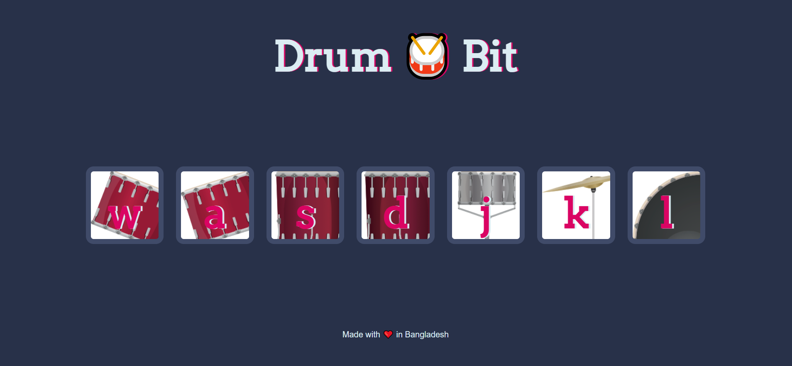

# Drum Bit

Drum Bit is a dynamic and interactive website that allows users to play the drums using their mouse or keyboard. With its intuitive interface and responsive design, users can click on different drum buttons or press corresponding keyboard keys to produce a variety of drum sounds. The project, built with HTML, CSS, and vanilla JavaScript, provides visual and sound feedback, giving users an engaging drumming experience. Whether you're a music enthusiast or simply looking for some rhythmic fun, Drum Bit offers an enjoyable and accessible way to unleash your inner drummer.

## Features

This website includes the following features:

* **Clickable Buttons:** Users can click on the drum bit buttons displayed on the webpage to play different drum sounds.
* **Keyboard Support:** Users can also play the drum sounds by pressing the corresponding keyboard keys. Each drum button is associated with a specific key, making it intuitive for users to play using their keyboards.
* **Visual Feedback:** When a drum button is clicked or a corresponding keyboard key is pressed, the button's appearance changes briefly, providing visual feedback to the user.
* **Sound Feedback:** Each drum button plays a unique drum sound when activated, allowing users to create rhythm and experiment with different beats.

## Technologies Used

This website is built using the following technologies:

* **HTML:** Provides the structure and layout of the website.
* **CSS:** Handles the visual styling and appearance.
* **JavaScript:** Implements the interactivity and functionality of the drum pads.

These technologies were chosen for their widespread use, compatibility with web browsers, and their ability to create interactive and visually appealing web pages.

## 🛠 Installation and Setup Instructions

1. git clone https://github.com/tawfik575/drum-bit.git
2. cd gradient-background-color-generator
3. start index.html

## Contributing

Contributions to Drum Bit are welcome! If you find a bug or have an idea for an improvement, please submit an issue or create a pull request. Make sure to follow the existing code style and provide detailed information about your changes.

## License

This project is licensed under the MIT License. Feel free to use, modify, and distribute the code as per the terms of the license.

## Contact

If you have any questions, suggestions, or feedback about the project, feel free to contact me at `tawfikbsmrstucse@gmail.com`.